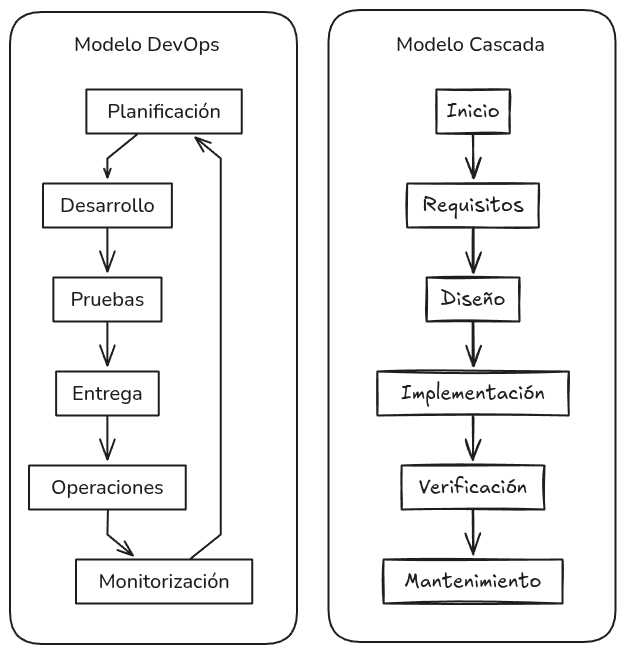

# Actividad 1: introducción devops, devsecops

---

Alumno: Diego Pineda Garcia
Fecha: 02/08/25
Tiempo Invertido:
Contexto del entorno:
El sistema operativo utilizado es Ubuntu 24.10 (x86_64) con el kernel 6.11.

---

---

### 4.1 DevOps vs. Cascada Tradicional

En el modelo en cascada, las fases son secuenciales y rígidas. El feedback solo se obtiene al final del ciclo, lo que significa que un error de diseño detectado en la fase de pruebas puede costar meses de retrabajo.

DevOps en cambio, se basa en un ciclo de feedback continuo, como se puede apreciar en mi diagrama `imagenes/devops-vs-cascada.png`. Este enfoque acelera la entrega y reduce el riesgo en entornos de nube de la siguiete forma:

1.  Pequeños Lotes de Trabajo: En lugar de desplegar un producto entero cada seis meses, se despliegan pequeñas funcionalidades de forma continua. Un cambio pequeño es más fácil de entender, probar y revertir si algo sale mal, minimizando el "radio de impacto" de un fallo.
2.  Feedback Continuo y Automatizado: Cada cambio es validado automáticamente por un pipeline de integración continua (CI). Si un commit introduce un bug, el equipo lo sabe en minutos, no en meses, reduciendo drásticamente el costo de la corrección.
3.  Automatización de la Infraestructura: En la nube, la infraestructura se puede crear y destruir mediante código (IaC), lo que permite tener entornos de prueba idénticos a producción, eliminando la clásica excusa de "en mi máquina funcionaba".

**Pregunta Retadora: ¿Cuándo es razonable un enfoque cercano a cascada?**

Un enfoque más cercano a cascada sigue siendo razonable en contextos donde la irreversibilidad del despliegue y la certificación regulatoria externa son los factores dominantes. Por ejemplo, en el desarrollo de firmware para dispositivos médicos implantables o sistemas de aviónica.

- **Criterio Verificable 1:** Aprobación Regulatoria Mandatoria. El software debe pasar una certificación formal por un ente externo (como la FDA o la EASA) antes de poder ser distribuido.
- **Criterio Verificable 2:** Inmutabilidad del Despliegue Físico. El software se graba en un componente de hardware que no puede ser actualizado remotamente. No existe la posibilidad de un "hotfix" o un "rollback". El costo de un fallo es extremadamente alto, justificando un ciclo de validación exhaustivo y secuencial.

El trade-off es claro: se sacrifica velocidad y agilidad para obtener la máxima seguridad, conformidad y predictibilidad, lo cual es una decisión de negocio deliberada y correcta en dichos contextos.

### 4.2 Ciclo Tradicional de Dos Pasos y Silos

El modelo tradicional de "construcción --> operación" se caracteriza por la existencia de silos organizacionales, como se ilustra en `imagenes/silos-equipos.png`. Los equipos de Desarrollo,QA y Operaciones trabajan de forma aislada, con objetivos e incentivos en ocasiones contrapuestos. Este modelo presenta limitaciones severas:

1.  **Costo de Integración Tardía:** Los equipos trabajan en sus propios entornos y solo integran sus componentes al final del ciclo. Esto genera un "infierno de integración" donde los problemas de compatibilidad son difíciles de diagnosticar y costosos de resolver, causando retrasos significativos.
2.  **Asimetría de Información y Fricción:** Desarrollo desconoce las restricciones del entorno de producción, mientras que Operaciones no tiene visibilidad sobre los cambios del código. Este desconocimiento mutuo lleva a un "juego de culpas" durante las incidencias, en lugar de una resolución colaborativa.

**Pregunta Retadora: Anti-patrones que agravan incidentes**

- **"Throw over the wall":** Este anti-patrón ocurre cuando el equipo de desarrollo finaliza una funcionalidad y la transfiere a QA u Operaciones sin mayor contexto o responsabilidad compartida (un _handoff_). Agrava incidentes porque el equipo que debe resolver el problema en producción (Operaciones) carece del conocimiento profundo del código. Esto aumenta exponencialmente el Tiempo Medio de Recuperación (MTTR), ya que necesitan escalar el problema de vuelta a un desarrollador que ya puede estar trabajando en otra cosa.
- **Seguridad como Auditoría Tardía:** En este modelo, la seguridad es una fase final, justo antes del despliegue, donde un equipo externo realiza pruebas. Agrava incidentes y retrabajos porque si se encuentra una vulnerabilidad de diseño fundamental, la solución puede requerir cambios arquitectónicos masivos, invalidando semanas o meses de trabajo. Fomenta la percepción de la seguridad como un "bloqueador" en lugar de una responsabilidad compartida, lo que desincentiva las buenas prácticas durante el desarrollo.

### 4.3 Principios y Beneficios de DevOps

DevOps se fundamenta en principios de colaboración, automatización y feedback, siendo Agile su precursor cultural. La **Integración Continua (CI)** y la **Entrega Continua (CD)** son sus pilares técnicos.

- **CI (Integración Continua):** Es la práctica de integrar cambios de código en un repositorio central varias veces al día. Cada integración dispara una construcción y un conjunto de pruebas automatizadas cercanas al código (unitarias, de componente). El objetivo es detectar errores de integración de forma inmediata, cuando son más fáciles y baratos de corregir. Fomenta la colaboración al obligar a los desarrolladores a mantener su código sincronizado constantemente.
- **CD (Entrega/Despliegue Continuo):** Es la extensión lógica de CI. Si todas las etapas automatizadas del pipeline (construcción, pruebas, análisis de seguridad) pasan con éxito, el cambio se considera listo para ser desplegado. La CD automatiza el proceso de despliegue, asegurando que cualquier cambio pueda llegar a producción de forma rápida y fiable.

Una **práctica Agile** como la retrospectiva de sprint alimenta directamente las decisiones del pipeline. Si durante una retrospectiva el equipo identifica que un despliegue reciente falló debido a un problema de rendimiento no detectado, una acción concreta sería "añadir una etapa de pruebas de carga automatizadas al pipeline de CD". De esta forma, una reunión de mejora de procesos (Agile) se traduce en una mejora técnica tangible y automatizada (pipeline).

**Indicador observable de mejora de colaboración:**

Un indicador clave es el "Lead Time for Changes": el tiempo que transcurre desde que un commit es enviado a la rama principal hasta que es desplegado en producción.

Para recolectarlo sin herramientas de pago, se puede utilizar un script que:

1.  Extraiga la fecha del commit de los **metadatos de Git** (`git log`).
2.  Capture la fecha de finalización del despliegue desde los registros del sistema de CI/CD (ej. logs de GitHub Actions, Jenkins, o incluso un simple `echo $(date)` al final del script de despliegue).
3.  Calcule la diferencia y la guarde en un archivo CSV.
    Una tendencia a la baja en este indicador a lo largo del tiempo demuestra una mejora tangible en la fluidez y colaboración entre Dev y Ops.
