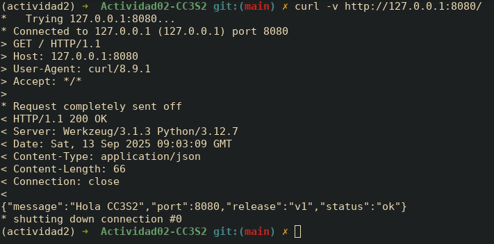

## 1) HTTP: Fundamentos y herramientas

### 1. **Levanta la app** con variables de entorno (12-Factor):

Creamos app.py y el entorno virtual para trabajar

Levantamos app.py con el comando `PORT=8080 MESSAGE="Hola CC3S2" RELEASE="v1" python3 app.py`

### 2. Inspección con `curl`:

Resultado de `curl -v http://127.0.0.1:8080/`

`curl -i -X POST http://127.0.0.1:8080/`

