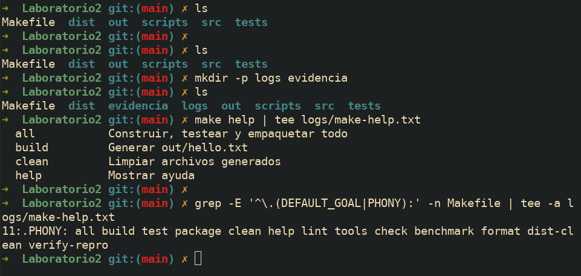
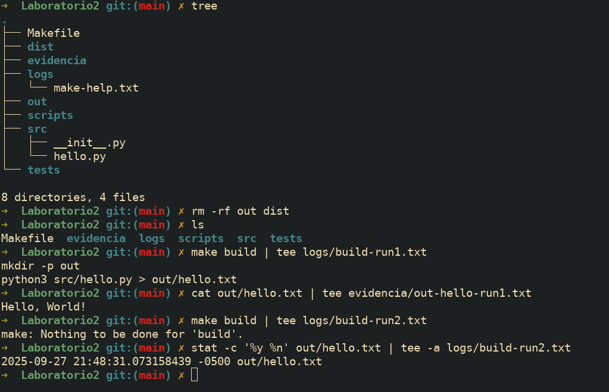
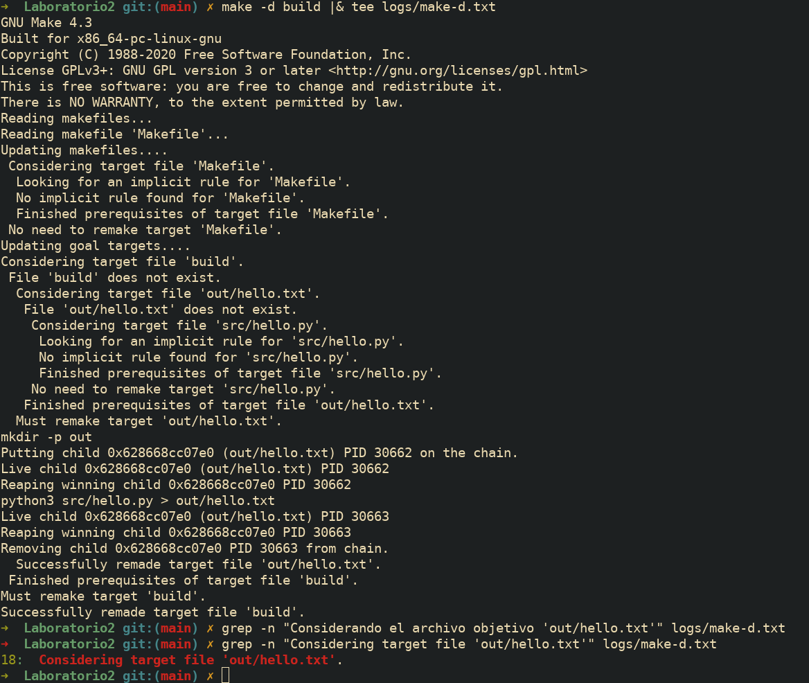
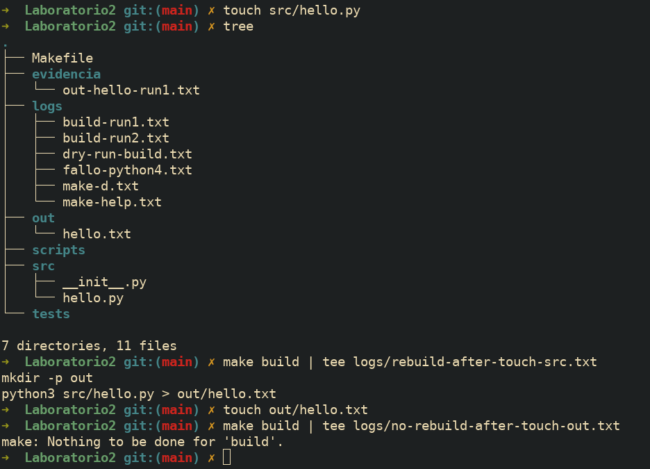
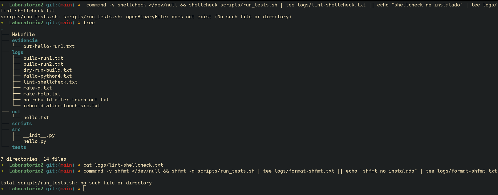
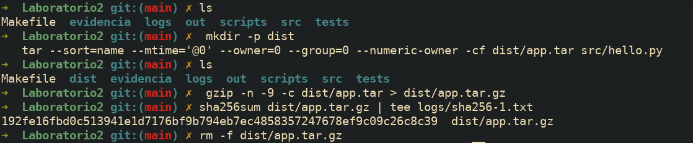
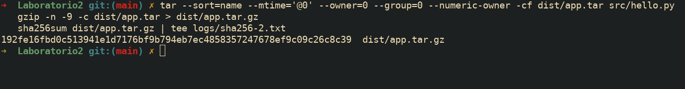
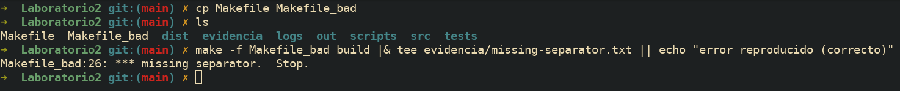

### Ejercicios planteados

1.  Ejecuta `make help` y guarda la salida para análisis. Luego inspecciona `.DEFAULT_GOAL` y `.PHONY` dentro del Makefile.
    Comandos:

    ```bash
    mkdir -p logs evidencia
    make help | tee logs/make-help.txt
    grep -E '^\.(DEFAULT_GOAL|PHONY):' -n Makefile | tee -a logs/make-help.txt
    ```

    **Respuesta:**

    El `target help` utiliza una combinación de `grep` y `awk` para escanear el propio `Makefile` en busca de líneas que contengan comentarios formateados con `##`, mostrando así los `targets` disponibles como se aprecia en `logs/make-help.txt`. La directiva `.DEFAULT_GOAL := help` le indica a `make` que, si se ejecuta sin especificar un objetivo, debe actuar como si se hubiera invocado `make help`. Finalmente, `PHONY` se declara para `help` y otros `targets` lógicos para indicar que son acciones y no archivos, evitando conflictos y asegurando que siempre se ejecuten.

    

2.  Comprueba la generación e idempotencia de `build`. Limpia salidas previas, ejecuta `build`, verifica el contenido y repite `build` para constatar que no rehace nada si no cambió la fuente.
    Comandos:

    ```bash
    rm -rf out dist
    make build | tee logs/build-run1.txt
    cat out/hello.txt | tee evidencia/out-hello-run1.txt
    make build | tee logs/build-run2.txt
    stat -c '%y %n' out/hello.txt | tee -a logs/build-run2.txt
    ```

    **Respuesta:**

    En la primera corrida, cuya salida está almacenada en `logs/build-run1.txt`, Make detecta que el objetivo `out/hello.txt` no existe y, siguiendo su grafo de dependencias, ejecuta la receta para crearlo. En la segunda corrida (`logs/build-run2.txt`), Make compara la marca de tiempo de `out/hello.txt` con la de su dependencia, `src/hello.py`. Como el objetivo ya existe y no es más antiguo que su fuente, Make concluye que está actualizado y no realiza ningún trabajo, como confirma el mensaje: `make: Nothing to be done for 'build'`. Este comportamiento, basado en timestamps, evita reconstrucciones innecesarias y acelera los pipelines.

    

3.  Fuerza un fallo controlado para observar el modo estricto del shell y `.DELETE_ON_ERROR`. Sobrescribe `PYTHON` con un intérprete inexistente y verifica que no quede artefacto corrupto.
    Comandos:

    ```bash
    rm -f out/hello.txt
    PYTHON=python4 make build ; echo "exit=$?" | tee logs/fallo-python4.txt || echo "falló (esperado)"
    ls -l out/hello.txt | tee -a logs/fallo-python4.txt || echo "no existe (correcto)"
    ```

    **Respuesta:**

    El uso de `-e -u -o pipefail` en `.SHELLFLAGS` asegura que cualquier error en la receta (como un intérprete inexistente) detenga la ejecución inmediatamente, evitando estados inconsistentes. La directiva `.DELETE_ON_ERROR` complementa esto al eliminar el archivo objetivo parcial si la regla falla. Al forzar `PYTHON=python4`, la receta aborta y, como se evidencia en el log, `out/hello.txt` no es creado, previniendo así que un artefacto corrupto contamine el pipeline.

    

4.  Realiza un "ensayo" (dry-run) y una depuración detallada para observar el razonamiento de Make al decidir si rehacer o no.
    Comandos:

    ```bash
    make -n build | tee logs/dry-run-build.txt
    make -d build |& tee logs/make-d.txt
    grep -n "Considerando el archivo objetivo 'out/hello.txt'" logs/make-d.txt
    ```

    **Respuesta:**

    `make -n` muestra que se ejecutarían `mkdir -p out` y `python3 src/hello.py > out/hello.txt`, evidenciando que el `target` se reconstruiría. Con `make -d`, Make explica su decisión: “Considerando el archivo objetivo…” y, al no encontrarlo, concluye que debe rehacerlo (“Must remake target 'out/hello.txt'”). Estas trazas muestran la lógica incremental: solo se rehace cuando el `target` falta o es más antiguo que su prerrequisito. El ensayo y la depuración confirman que Make evalúa tiempos y dependencias para evitar trabajo innecesario.

    

5.  Demuestra la incrementalidad con marcas de tiempo. Primero toca la **fuente** y luego el **target** para comparar comportamientos.
    Comandos:

    ```bash
    touch src/hello.py
    make build | tee logs/rebuild-after-touch-src.txt
    touch out/hello.txt
    make build | tee logs/no-rebuild-after-touch-out.txt
    ```

    **Respuesta:**

    Cuando se ejecuta `touch src/hello.py`, su `timestamp` se actualiza y se vuelve más reciente que el de `out/hello.txt`, por lo que Make detecta que el `target` está desactualizado y ejecuta la regla `build`. En cambio, al tocar `out/hello.txt`, el objetivo sigue siendo igual o más reciente que su fuente, por lo que Make concluye que no hay trabajo pendiente y no rehace nada. Esto demuestra su lógica incremental: solo se reconstruye cuando un prerrequisito cambia.

    

6.  Ejecuta verificación de estilo/formato **manual** (sin objetivos `lint/tools`). Si las herramientas están instaladas, muestra sus diagnósticos; si no, deja evidencia de su ausencia.
    Comandos:

    ```bash
    command -v shellcheck >/dev/null && shellcheck scripts/run_tests.sh | tee logs/lint-shellcheck.txt || echo "shellcheck no instalado" | tee logs/lint-shellcheck.txt
    command -v shfmt >/dev/null && shfmt -d scripts/run_tests.sh | tee logs/format-shfmt.txt || echo "shfmt no instalado" | tee logs/format-shfmt.txt
    ```

    **Respuesta:**

    En mi entorno, `shellcheck` y `shfmt` están disponibles, pero la verificación falló porque el script `scripts/run_tests.sh` no existe en el proyecto en esta etapa. Esto se puede ver en los mensajes de error capturados en los logs. Si el archivo estuviera presente, `shellcheck` reportaría advertencias sobre buenas prácticas (como el uso de comillas) y `shfmt` sugeriría ajustes de formato. Para completar la verificación, se debe crear el script; en sistemas Linux, estas herramientas se instalan con `sudo apt-get install shellcheck shfmt`.

    

7.  Construye un paquete **reproducible** de forma manual, fijando metadatos para que el hash no cambie entre corridas idénticas. Repite el empaquetado y compara hashes.
    Comandos:

    ```bash
    mkdir -p dist
    # ... (comandos de tar y gzip)
    ```

    **Respuesta:**

    El hash SHA-256 se mantuvo idéntico en ambas ejecuciones, demostrando que el paquete es reproducible. Esto se logra porque los flags de `tar` y `gzip` eliminan toda la variabilidad de los metadatos: `--sort=name` ordena los archivos; `--mtime='@0'` fija la marca de tiempo a la época Unix; `--owner=0`, `--group=0` y `--numeric-owner` normalizan los permisos; y `gzip -n` evita almacenar el `timestamp` en el encabezado del archivo comprimido.

    

	 Repetimos los 3 ultimos comandos con la variacion en `sha256-2.txt`
	 
    

8.  Reproduce el error clásico "missing separator" **sin tocar el Makefile original**. Crea una copia, cambia el TAB inicial de una receta por espacios, y confirma el error.
    Comandos:

    ```bash
    cp Makefile Makefile_bad
    # (Edición manual)
    make -f Makefile_bad build |& tee evidencia/missing-separator.txt || echo "error reproducido (correcto)"
    ```

    **Respuesta:**

    Make exige que cada línea de receta comience con un carácter TAB para distinguirlas de las definiciones de variables y reglas. Si se reemplaza el TAB por espacios, Make interpreta la línea como sintaxis inválida y muestra el error clásico `*** missing separator`. Este problema se diagnostica revisando la línea indicada en el error y confirmando los caracteres invisibles (por ejemplo, con `cat -A`). La solución es restaurar el TAB o, alternativamente, definir la variable `.RECIPEPREFIX` para usar otro prefijo.

    
