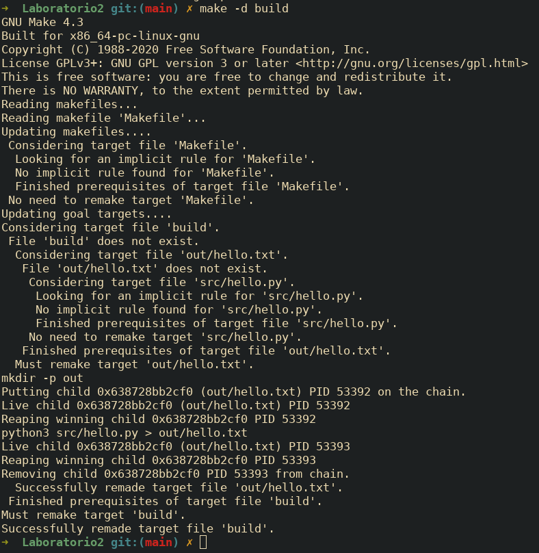

## Ejercicios planteados

### Parte 1: Construir - Makefile y Bash desde cero

1.  Ejecuta `make help` y guarda la salida para análisis. Luego inspecciona `.DEFAULT_GOAL` y `.PHONY` dentro del Makefile.
    Comandos:

    ```bash
    mkdir -p logs evidencia
    make help | tee logs/make-help.txt
    grep -E '^\.(DEFAULT_GOAL|PHONY):' -n Makefile | tee -a logs/make-help.txt
    ```

    **Respuesta:**

    El `target help` utiliza una combinación de `grep` y `awk` para escanear el propio `Makefile` en busca de líneas que contengan comentarios formateados con `##`, mostrando así los `targets` disponibles como se aprecia en `logs/make-help.txt`. La directiva `.DEFAULT_GOAL := help` le indica a `make` que, si se ejecuta sin especificar un objetivo, debe actuar como si se hubiera invocado `make help`. Finalmente, `PHONY` se declara para `help` y otros `targets` lógicos para indicar que son acciones y no archivos, evitando conflictos y asegurando que siempre se ejecuten.

    

2.  Comprueba la generación e idempotencia de `build`. Limpia salidas previas, ejecuta `build`, verifica el contenido y repite `build` para constatar que no rehace nada si no cambió la fuente.
    Comandos:

    ```bash
    rm -rf out dist
    make build | tee logs/build-run1.txt
    cat out/hello.txt | tee evidencia/out-hello-run1.txt
    make build | tee logs/build-run2.txt
    stat -c '%y %n' out/hello.txt | tee -a logs/build-run2.txt
    ```

    **Respuesta:**

    En la primera ejecución, cuya salida está almacenada en `logs/build-run1.txt`, Make detecta que el objetivo `out/hello.txt` no existe y, siguiendo su grafo de dependencias, ejecuta la receta para crearlo. En la segunda ejecución (`logs/build-run2.txt`), Make compara la marca de tiempo de `out/hello.txt` con la de su dependencia, `src/hello.py`. Como el objetivo ya existe y no es más antiguo que su fuente, Make concluye que está actualizado y no realiza ningún trabajo, como confirma el mensaje: `make: Nothing to be done for 'build'`. Este comportamiento, basado en timestamps, evita reconstrucciones innecesarias y acelera los pipelines.

    

3.  Fuerza un fallo controlado para observar el modo estricto del shell y `.DELETE_ON_ERROR`. Sobrescribe `PYTHON` con un intérprete inexistente y verifica que no quede artefacto corrupto.
    Comandos:

    ```bash
    rm -f out/hello.txt
    PYTHON=python4 make build ; echo "exit=$?" | tee logs/fallo-python4.txt || echo "falló (esperado)"
    ls -l out/hello.txt | tee -a logs/fallo-python4.txt || echo "no existe (correcto)"
    ```

    **Respuesta:**

    El uso de `-e -u -o pipefail` en `.SHELLFLAGS` asegura que cualquier error en la receta (como un intérprete inexistente) detenga la ejecución inmediatamente, evitando estados inconsistentes. La directiva `.DELETE_ON_ERROR` complementa esto al eliminar el archivo objetivo parcial si la regla falla. Al forzar `PYTHON=python4`, la receta aborta y, como se evidencia en el log, `out/hello.txt` no es creado, previniendo así que un artefacto corrupto contamine el pipeline.

    

4.  Realiza un "ensayo" (dry-run) y una depuración detallada para observar el razonamiento de Make al decidir si rehacer o no.
    Comandos:

    ```bash
    make -n build | tee logs/dry-run-build.txt
    make -d build |& tee logs/make-d.txt
    grep -n "Considerando el archivo objetivo 'out/hello.txt'" logs/make-d.txt
    ```

    **Respuesta:**

    `make -n` muestra que se ejecutarían `mkdir -p out` y `python3 src/hello.py > out/hello.txt`, evidenciando que el `target` se reconstruiría. Con `make -d`, Make explica su decisión: “Considerando el archivo objetivo…” y, al no encontrarlo, concluye que debe rehacerlo (“Must remake target 'out/hello.txt'”). Estas trazas muestran la lógica incremental: solo se rehace cuando el `target` falta o es más antiguo que su prerrequisito. El ensayo y la depuración confirman que Make evalúa tiempos y dependencias para evitar trabajo innecesario.

    

5.  Demuestra la incrementalidad con marcas de tiempo. Primero toca la **fuente** y luego el **target** para comparar comportamientos.
    Comandos:

    ```bash
    touch src/hello.py
    make build | tee logs/rebuild-after-touch-src.txt
    touch out/hello.txt
    make build | tee logs/no-rebuild-after-touch-out.txt
    ```

    **Respuesta:**

    Cuando se ejecuta `touch src/hello.py`, su `timestamp` se actualiza y se vuelve más reciente que el de `out/hello.txt`, por lo que Make detecta que el `target` está desactualizado y ejecuta la regla `build`. En cambio, al crear `out/hello.txt`, el objetivo sigue siendo igual o más reciente que su fuente, por lo que Make concluye que no hay trabajo pendiente y no rehace nada.

    

6.  Ejecuta verificación de estilo/formato **manual** (sin objetivos `lint/tools`). Si las herramientas están instaladas, muestra sus diagnósticos; si no, deja evidencia de su ausencia.
    Comandos:

    ```bash
    command -v shellcheck >/dev/null && shellcheck scripts/run_tests.sh | tee logs/lint-shellcheck.txt || echo "shellcheck no instalado" | tee logs/lint-shellcheck.txt
    command -v shfmt >/dev/null && shfmt -d scripts/run_tests.sh | tee logs/format-shfmt.txt || echo "shfmt no instalado" | tee logs/format-shfmt.txt
    ```

    **Respuesta:**

    En mi entorno, `shellcheck` y `shfmt` están disponibles, pero la verificación falló porque el script `scripts/run_tests.sh` no existe en el proyecto en esta etapa. Esto se puede ver en los mensajes de error capturados en los logs. Si el archivo estuviera presente, `shellcheck` reportaría advertencias sobre buenas prácticas (como el uso de comillas) y `shfmt` sugeriría ajustes de formato. En caso no contar con las herramientas, estas se pueden instalar con `sudo apt-get install shellcheck shfmt`.

    

7.  Construye un paquete **reproducible** de forma manual, fijando metadatos para que el hash no cambie entre corridas idénticas. Repite el empaquetado y compara hashes.
    Comandos:

    ```bash
    mkdir -p dist
    # ... (comandos de tar y gzip)
    ```

    **Respuesta:**

    El hash SHA-256 se mantuvo idéntico en ambas ejecuciones, demostrando que el paquete es reproducible. Esto se logra porque los flags de `tar` y `gzip` eliminan toda la variabilidad de los metadatos: `--sort=name` ordena los archivos; `--mtime='@0'` fija la marca de tiempo a la época Unix; `--owner=0`, `--group=0` y `--numeric-owner` normalizan los permisos; y `gzip -n` evita almacenar el `timestamp` en el encabezado del archivo comprimido.

    

    Repetimos los 3 ultimos comandos con la variacion en `sha256-2.txt`

    

8.  Reproduce el error clásico "missing separator" **sin tocar el Makefile original**. Crea una copia, cambia el TAB inicial de una receta por espacios, y confirma el error.
    Comandos:

    ```bash
    cp Makefile Makefile_bad
    # (Edición manual)
    make -f Makefile_bad build |& tee evidencia/missing-separator.txt || echo "error reproducido (correcto)"
    ```

    **Respuesta:**

    Make exige que cada línea de receta comience con un carácter tab para distinguirlas de las definiciones de variables y reglas. Si se reemplaza el tab por espacios, Make interpreta la línea como sintaxis inválida y muestra el error clásico `*** missing separator`. Este problema se diagnostica revisando la línea indicada en el error y confirmando los caracteres invisibles. La solución es restaurar el tab o definir la variable `.RECIPEPREFIX` para usar otro prefijo.

    

#### 1.3

**Ejercicios:**

- Ejecuta ./scripts/run_tests.sh en un repositorio limpio. Observa las líneas "Demostrando pipefail": primero sin y luego con pipefail.

  Verifica que imprime "Test pasó" y termina exitosamente con código 0 (`echo $?`).
- Edita src/hello.py para que no imprima "Hello, World!". Ejecuta el script: verás "Test falló", moverá hello.py a hello.py.bak, y el **trap** lo restaurará. Confirma código 2 y ausencia de .bak.

**Modificacion**


**Ejecución del script**

- Ejecuta `bash -x scripts/run_tests.sh`. Revisa el trace: expansión de `tmp` y `PY`, llamadas a funciones, here-doc y tuberías. Observa el trap armado al inicio y ejecutándose al final; estado 0.


- Sustituye `output=$("$PY" "$script")` por `("$PY" "$script")`. Ejecuta script. `output` queda indefinida; con `set -u`, al referenciarla en `echo` aborta antes de `grep`. El trap limpia y devuelve código distinto no-cero.


### Parte 2: Leer - Analizar un repositorio completo

**Ejercicios:**

- Ejecuta `make -n all` para un dry-run que muestre comandos sin ejecutarlos; identifica expansiones `$@` y `$<`, el orden de objetivos y cómo `all` encadena `tools`, `lint`, `build`, `test`, `package`.


- Ejecuta `make -d build` y localiza líneas "Considerando el archivo objetivo" y "Debe deshacerse", explica por qué recompila o no `out/hello.txt` usando marcas de tiempo y cómo `mkdir -p $(@D)` garantiza el directorio.
**Rpta:**  En el log de make -d se observa la línea “Considering target file 'out/hello.txt'” seguida de “File 'out/hello.txt' does not exist”, lo que indica que Make evalúa el objetivo y detecta que falta. Luego aparece “Must remake target 'out/hello.txt'”, por lo que recompila ejecutando mkdir -p out y python3 src/hello.py > out/hello.txt. Esta decisión se basa en las marcas de tiempo: si el target no existe o es más antiguo que su prerequisito (src/hello.py), Make lo rehace. El uso de mkdir -p $(@D) garantiza que el directorio out/ exista antes de redirigir la salida, evitando errores por rutas inexistentes. 

  

- Fuerza un entorno con BSD tar en PATH y corre `make tools`; comprueba el fallo con "Se requiere GNU tar" y razona por qué `--sort`, `--numeric-owner` y `--mtime` son imprescindibles para reproducibilidad determinista.

- Ejecuta `make verify-repro`; observa que genera dos artefactos y compara `SHA256_1` y `SHA256_2`. Si difieren, hipótesis: zona horaria, versión de tar, contenido no determinista o variables de entorno no fijadas.

  

- Corre `make clean && make all`, cronometrando; repite `make all` sin cambios y compara tiempos y logs. Explica por qué la segunda es más rápida gracias a timestamps y relaciones de dependencia bien declaradas.
- **Rpta:** La primera ejecución tarda más porque Make debe generar out/hello.txt, correr tests y empaquetar. En la segunda, Make compara marcas de tiempo: como los targets (out/hello.txt, dist/app.tar.gz) son más recientes que sus prerequisitos (src/hello.py, scripts), concluye que no hay trabajo pendiente. Gracias a esta lógica incremental y a dependencias bien declaradas, evita rehacer tareas costosas, reduciendo el tiempo a casi cero. Esto demuestra cómo Make optimiza el flujo en pipelines CI/CD.

  
- Ejecuta `PYTHON=python3.12 make test` (si existe). Verifica con `python3.12 --version` y mensajes que el override funciona gracias a `?=` y a `PY="${PYTHON:-python3}"` en el script; confirma que el artefacto final no cambia respecto al intérprete por defecto.

  

- Ejecuta `make test`; describe cómo primero corre `scripts/run_tests.sh` y luego `python -m unittest`. Determina el comportamiento si el script de pruebas falla y cómo se propaga el error a la tarea global.

- Ejecuta `touch src/hello.py` y luego `make all`; identifica qué objetivos se rehacen (`build`, `test`, `package`) y relaciona el comportamiento con el timestamp actualizado y la cadena de dependencias especificada.
**Rpta:**  Al ejecutar touch src/hello.py y luego make all, Make detecta que la fuente es más reciente que el target out/hello.txt, por lo que rehace el objetivo build. Esto a su vez obliga a regenerar el paquete (package) y a ejecutar los tests (test). Las tareas lint y tools también corren porque son .PHONY. Este comportamiento se basa en las marcas de tiempo y en la cadena de dependencias declarada en el Makefile. Además, la receta usa mkdir -p $(@D) para garantizar que el directorio de salida exista antes de escribir el archivo, evitando fallos por rutas inexistentes.


 

  
- Ejecuta `make -j4 all` y observa ejecución concurrente de objetivos independientes; confirma resultados idénticos a modo secuencial y explica cómo `mkdir -p $(@D)` y dependencias precisas evitan condiciones de carrera.
  
 
- Ejecuta `make lint` y luego `make format`; interpreta diagnósticos de `shellcheck`, revisa diferencias aplicadas por `shfmt` y, si está disponible, considera la salida de `ruff` sobre `src/` antes de empaquetar.
 
### Parte 3: Extender

#### 3.1 `lint` mejorado

Rompe a propósito un *quoting* en `scripts/run_tests.sh` (por ejemplo, quita comillas a una variable que pueda contener espacios) y ejecuta `make lint`. `shellcheck` debe reportar el problema; corrígelo y vuelve a correr.
Luego ejecuta `make format` para aplicar `shfmt` y estandarizar estilo. Si tienes `ruff`, inspecciona Python y corrige advertencias.
*(Nota: si `ruff` no está instalado, el Makefile ya lo trata como opcional y no debe romper la build.)*

```bash
make lint
make format
ruff check src || true
```


#### 3.2 Rollback adicional

Este chequeo asegura que, si el temporal desaparece, el script falla limpiamente y el `trap` revierte el estado (restaura `hello.py` desde `.bak`) preservando el código de salida.
Borra el archivo temporal manualmente y observa el comportamiento: mensaje claro, salida no-cero, restauración y limpieza.
*(Sugerencia práctica para reproducir la condición sin ambigüedad: opcionalmente imprime la ruta del temporal y da una pequeña pausa antes del chequeo para poder borrarlo desde otra terminal, por ejemplo, añadir `echo "$tmp" > out/tmp_path.txt; sleep 3` justo antes del `if`.)*

```bash
# Al final de run_tests (sin cambiar nada más)
if [[ ! -f "$tmp" ]]; then
    echo "Error: archivo temporal perdido"
    exit 3
fi
```

```bash
# Prueba
./scripts/run_tests.sh
# (opcional) En otra terminal, borra el tmp antes del check:
# rm -f "$(cat out/tmp_path.txt)"
```


#### 3.3 Incrementalidad

Ejecuta dos veces `make benchmark` para comparar un build limpio frente a uno cacheado; revisa `out/benchmark.txt`. Después, modifica el *timestamp* del origen con `touch src/hello.py` y repite. Observa que `build`, `test` y `package` se rehacen.
Interpreta tiempos y relación con dependencias y marcas de tiempo.

```bash
make benchmark
make benchmark
touch src/hello.py
make benchmark
```

#### Checklist de Smoke-Tests - Bootstrap

Confirma permisos de ejecución del script, presencia de herramientas requeridas y ayuda autodocumentada. Espera que `make tools` falle temprano si falta una dependencia, con mensaje específico.
`make help` debe listar objetivos y descripciones extraídas de comentarios `##`, útil para *onboarding* y operación cotidiana.

```bash
chmod +x scripts/run_tests.sh
make tools
make help
```
**Respuesta:** Tanto make tools y make help cumplen con su cometido como se demostró durante la gran parte de esta Actividad 5
#### Checklist de Smoke-Tests - Primera pasada

Construye, prueba, empaqueta. Verifica que `out/hello.txt` exista y que `dist/app.tar.gz` solo contenga `hello.txt`. El empaquetado usa flags deterministas (`--sort`, `--numeric-owner`, `--owner=0`, `--group=0`, `--mtime='UTC 1970-01-01'`) para reproducibilidad bit a bit.
Cualquier diferencia sugiere herramienta incompatible (BSD tar) o contaminación del entorno (TZ o metadatos).

```bash
make all
ls -l out/hello.txt dist/app.tar.gz
tar -tzf dist/app.tar.gz
```

#### Checklist de Smoke-Tests - Incrementalidad

Compara tiempos entre ejecuciones consecutivas de `make benchmark`; la segunda debe ser más rápida por la caché de Make. Tras `touch src/hello.py`, espera reconstrucción de `build/test/package`.
Documenta el impacto en tiempos y explica cómo el grafo de dependencias dirige reconstrucciones mínimas necesarias.

```bash
make benchmark
make benchmark
touch src/hello.py
make benchmark
```

**Respuesta:** Este ejercicio se hizo anteriormente
#### Checklist de Smoke-Tests - Rollback

Introduce un cambio que rompa la aserción del test del script Bash y ejecútalo. Observa "Test falló", creación de `.bak`, código de salida `2` y restauración automática por `trap`.
*(Precisión: si rompes el `print` para que no contenga "Hello, World!", fallará el script Bash y `make test` se detendrá **antes** de `python -m unittest`. la función `greet` en sí sigue siendo válida.)*

```python
# src/hello.py
print(greet("Mundo"))
```

```bash
./scripts/run_tests.sh ; echo $?
git checkout -- src/hello.py
```


#### Checklist de Smoke-Tests - Lint y formato

Ejecuta `make lint` y corrige problemas de shell reportados por `shellcheck`. Aplica `make format` para normalizar estilo con `shfmt`. Si `ruff` está disponible, revisa `src` y corrige advertencias.
Mantén el build verde sin exigir `ruff` (guard clause), útil en máquinas heterogéneas.

```bash
make lint
make format
ruff check src || true
```

#### Checklist de Smoke-Tests - Limpieza

Asegura un entorno de compilación limpio y reproducible para CI y pruebas locales. `make dist-clean` elimina artefactos (`out/`, `dist/`) y cachés (`.ruff_cache`, `__pycache__`).
Luego, `make all` debe reconstruir todo desde cero sin depender de estado previo del árbol de trabajo.

```bash
make dist-clean
make all
```

#### Checklist de Smoke-Tests - Reproducibilidad

Valida que dos empaquetados consecutivos generen el mismo hash SHA256. Si difieren, revisa versión de `tar` (debe ser **GNU**), zona horaria (`TZ=UTC`), permisos y que no se cuelen archivos extra.
La verificación protege la cadena de suministro y evita *drift* entre desarrolladores y CI.

```bash
make verify-repro
```
**Respuesta:** Este ejercicio se hizo en la parte 2.