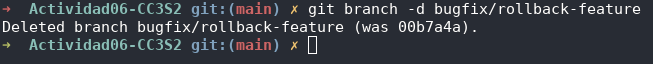

## Preguntas

- ¿Cómo te ha ayudado Git a mantener un historial claro y organizado de tus cambios?
- ¿Qué beneficios ves en el uso de ramas para desarrollar nuevas características o corregir errores?
- Realiza una revisión final del historial de commits para asegurarte de que todos los cambios se han registrado correctamente.
- Revisa el uso de ramas y merges para ver cómo Git maneja múltiples líneas de desarrollo.

## Ejercicios

### Ejercicio 1: Manejo avanzado de ramas y resolución de conflictos

**Objetivo:** Practicar la creación, fusión y eliminación de ramas, así como la resolución de conflictos que puedan surgir durante la fusión.

**Instrucciones:**

1.  **Crear una nueva rama para una característica:**
    - Crea una nueva rama llamada `feature/advanced-feature` desde la rama `main`:

           ```bash
           $ git branch feature/advanced-feature
           $ git checkout feature/advanced-feature
           ```

      

2.  **Modificar archivos en la nueva rama:**
    - Edita el archivo `main.py` para incluir una función adicional:

      ```python
      def greet():
          print('Hello como una función avanzada')

      greet()
      ```

    - Añade y confirma estos cambios en la rama `feature/advanced-feature`:

      ```bash
      $ git add main.py
      $ git commit -m "Agrega la funcion greet como función avanzada"
      ```

      

3.  **Simular un desarrollo paralelo en la rama main:**
    - Cambia de nuevo a la rama `main`:

      ```bash
      $ git checkout main
      ```

    - Edita el archivo `main.py` de forma diferente (por ejemplo, cambia el mensaje del print original):
      ```python
      print('Hello World-actualiado en main')
      ```
    - Añade y confirma estos cambios en la rama `main`:

      ```bash
      $ git add main.py
      $ git commit -m "Actualizar el mensaje main.py en la rama main"
      ```

      

4.  **Intentar fusionar la rama feature/advanced-feature en main:**
    - Fusiona la rama `feature/advanced-feature` en `main`:

      ```bash
      $ git merge feature/advanced-feature
      ```

      

5.  **Resolver el conflicto de fusión:**
    - Git generará un conflicto en `main.py`. Abre el archivo y resuelve el conflicto manualmente, eligiendo cómo combinar las dos versiones.
    - Después de resolver el conflicto, añade el archivo resuelto y completa la fusión:

      ```bash
      $ git add main.py
      $ git commit -m "Resuelve el conflicto de fusión entre la versión main y feature/advanced-feature"
      ```

      

6.  **Eliminar la rama fusionada:**
    - Una vez que hayas fusionado con éxito y resuelto los conflictos, elimina la rama `feature/advanced-feature`:

      ```bash
      $ git branch -d feature/advanced-feature
      ```

      

### Ejercicio 2: Exploración y manipulación del historial de commits

**Objetivo:** Aprender a navegar y manipular el historial de commits usando comandos avanzados de Git.

**Instrucciones:**

1. **Ver el historial detallado de commits:**
   - Usa el comando `git log` para explorar el historial de commits, pero esta vez con más detalle:

     ```bash
     $ git log -p
     ```

   - Examina las diferencias introducidas en cada commit. ¿Qué cambios fueron realizados en cada uno?

     

2. **Filtrar commits por autor:**
   - Usa el siguiente comando para mostrar solo los commits realizados por un autor específico:

     ```bash
     $ git log --author="TuNombre"
     ```

     

3. **Revertir un commit:**
   - Imagina que el commit más reciente en `main.py` no debería haberse hecho. Usa `git revert` para revertir ese commit:

     ```bash
     $ git revert HEAD
     ```

   - Verifica que el commit de reversión ha sido añadido correctamente al historial.

     

4. **Rebase interactivo:**
   - Realiza un rebase interactivo para combinar varios commits en uno solo. Esto es útil para limpiar el historial de commits antes de una fusión.
   - Usa el siguiente comando para empezar el rebase interactivo:

     ```bash
     $ git rebase -i HEAD~3
     ```

   - En el editor que se abre, combina los últimos tres commits en uno solo utilizando la opción `squash`.

     

5. **Visualización gráfica del historial:**
   - Usa el siguiente comando para ver una representación gráfica del historial de commits:

     ```bash
     $ git log --graph --oneline --all
     ```

   - Reflexiona sobre cómo el historial de tu proyecto se visualiza en este formato. ¿Qué información adicional puedes inferir?

     

### Ejercicio 3: Creación y gestión de ramas desde commits específicos

**Objetivo:** Practicar la creación de ramas desde commits específicos y comprender cómo Git maneja las referencias históricas.

**Instrucciones:**

1. **Crear una nueva rama desde un commit específico:**
   - Usa el historial de commits (`git log --oneline`) para identificar un commit antiguo desde el cual crear una nueva rama:

     ```bash
     $ git log --oneline
     ```

   - Crea una nueva rama `bugfix/rollback-feature` desde ese commit:

     ```bash
     $ git branch bugfix/rollback-feature <commit-hash>
     $ git checkout bugfix/rollback-feature
     ```

     

2. **Modificar y confirmar cambios en la nueva rama:**
   - Realiza algunas modificaciones en `main.py` que simulen una corrección de errores:
     ```python
     def greet():
         print('Error corregido en la función')
     ```
   - Añade y confirma los cambios en la nueva rama:

     ```bash
     $ git add main.py
     $ git commit -m "Corregir error en la funcionalidad de rollback"
     ```

     

3. **Fusionar los cambios en la rama principal:**
   - Cambia de nuevo a la rama `main` y fusiona la rama `bugfix/rollback-feature`:

     ```bash
     $ git checkout main
     $ git merge bugfix/rollback-feature
     ```

     

4. **Explorar el historial después de la fusión:**
   - Usa `git log` y `git log --graph` para ver cómo se ha integrado el commit en el historial:

     ```bash
     $ git log --graph --oneline
     ```

     

5. **Eliminar la rama bugfix/rollback-feature:**
   - Una vez fusionados los cambios, elimina la rama `bugfix/rollback-feature`:

     ```bash
     $ git branch -d bugfix/rollback-feature
     ```

     

### Ejercicio 4: Manipulación y restauración de commits con git reset y git restore

**Objetivo:** Comprender cómo usar `git reset` y `git restore` para deshacer cambios en el historial y en el área de trabajo.

**Instrucciones:**

1. **Hacer cambios en el archivo main.py:**
   - Edita el archivo `main.py` para introducir un nuevo cambio:

     ````python
     print('Este cambio se restablecerá')

     ```
     - Añade y confirma los cambios:

     ```bash
     $ git add main.py
     $ git commit -m "Introduce un cambio para restablecer"
     ````

     

2. **Usar git reset para deshacer el commit:**
   - Deshaz el commit utilizando `git reset` para volver al estado anterior:

     ```bash
     $ git reset --hard HEAD~1
     ```

   - Verifica que el commit ha sido eliminado del historial y que el archivo ha vuelto a su estado anterior.

     

3. **Usar git restore para deshacer cambios no confirmados:**
   - Realiza un cambio en `README.md` y no lo confirmes:

     ```bash
     $ echo "Agrega linea en README" >> README.md
     $ git status
     ```

   - Usa `git restore` para deshacer este cambio no confirmado:

     ```bash
     $ git restore README.md
     ```

   - Verifica que el cambio no confirmado ha sido revertido.

     

### Ejercicio 5: Trabajo colaborativo y manejo de Pull Requests

**Objetivo:** Simular un flujo de trabajo colaborativo utilizando ramas y pull requests.

**Instrucciones:**

1. **Crear un nuevo repositorio remoto:**
   - Usa GitHub o GitLab para crear un nuevo repositorio remoto y clónalo localmente:

     ```bash
     $ git clone <URL-del-repositorio>
     ```

     

2. **Crear una nueva rama para desarrollo de una característica:**
   - En tu repositorio local, crea una nueva rama `feature/team-feature`:

     ```bash
     $ git branch feature/team-feature
     $ git checkout feature/team-feature
     ```

     

3. **Realizar cambios y enviar la rama al repositorio remoto:**
   - Realiza cambios en los archivos del proyecto y confírmalos:

     ```bash
     $ echo "print('Colaboracion es clave!')" > colaboracion.py
     $ git add .
     $ git commit -m "Agrega script de colaboración"
     ```

   - Envía la rama al repositorio remoto:

     ```bash
     $ git push origin feature/team-feature
     ```

     

4. **Abrir un Pull Request:**
   - Abre un Pull Request (PR) en la plataforma remota (GitHub/GitLab) para fusionar `feature/team-feature` con la rama `main`.
   - Añade una descripción detallada del PR, explicando los cambios realizados y su propósito.

     

5. **Revisar y fusionar el Pull Request:**
   - Simula la revisión de código, comenta en el PR y realiza cualquier cambio necesario basado en la retroalimentación.
   - Una vez aprobado, fusiona el PR en la rama `main`.

     

6. **Eliminar la rama remota y local:**
   - Después de la fusión, elimina la rama tanto local como remotamente:

     ```bash
     $ git branch -d feature/team-feature
     $ git push origin --delete feature/team-feature
     ```

     

### Ejercicio 6: Cherry-Picking y Git Stash

**Objetivo:** Aprender a aplicar commits específicos a otra rama utilizando `git cherry-pick` y a guardar temporalmente cambios no confirmados utilizando `git stash`.

**Instrucciones:**

1. **Hacer cambios en main.py y confirmarlos:**
   - Realiza y confirma varios cambios en `main.py` en la rama `main`:

     ```bash
     $ echo "print('Cherry pick!')" >> main.py
     $ git add main.py
     $ git commit -m "Agrega ejemplo de cherry-pick"
     ```

     

2. **Crear una nueva rama y aplicar el commit específico:**
   - Crea una nueva rama `feature/cherry-pick` y aplícale el commit específico:

     ```bash
     $ git branch feature/cherry-pick
     $ git checkout feature/cherry-pick
     $ git cherry-pick <commit-hash>
     ```

     

3. **Guardar temporalmente cambios no confirmados:**
   - Realiza algunos cambios en `main.py` pero no los confirmes:

     ```bash
     $ echo "Este cambio está en el stash" >> main.py
     $ git status
     ```

   - Guarda temporalmente estos cambios utilizando `git stash`:

     ```bash
     $ git stash
     ```

     

4. **Aplicar los cambios guardados:**
   - Realiza otros cambios y confírmalos si es necesario.
   - Luego, recupera los cambios guardados anteriormente:

     ```bash
     $ git stash pop
     ```

     

5. **Revisar el historial y confirmar la correcta aplicación de los cambios:**
   - Usa `git log` para revisar el historial de commits y verificar que todos los cambios se han aplicado correctamente.

     
