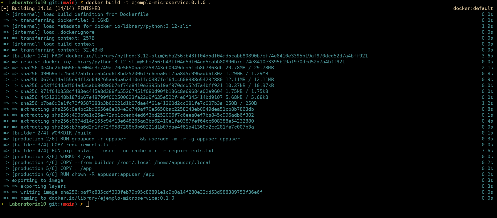
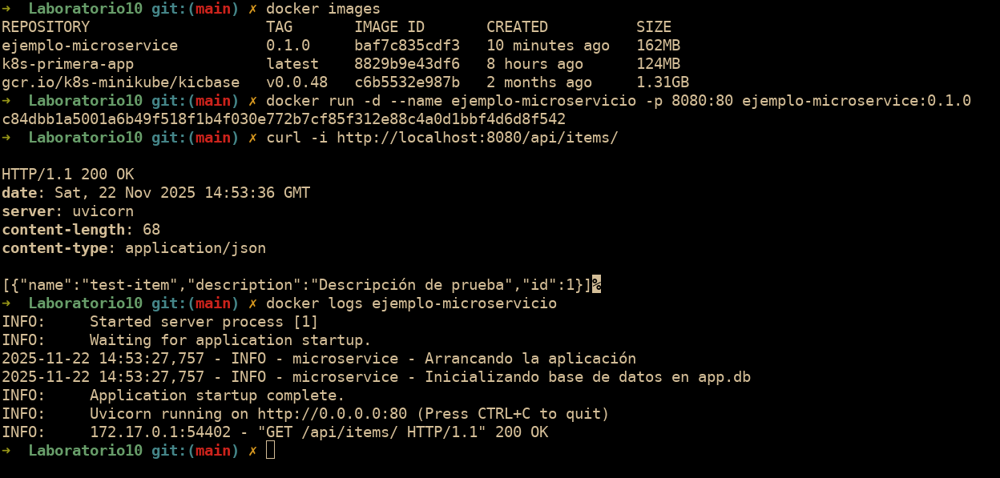
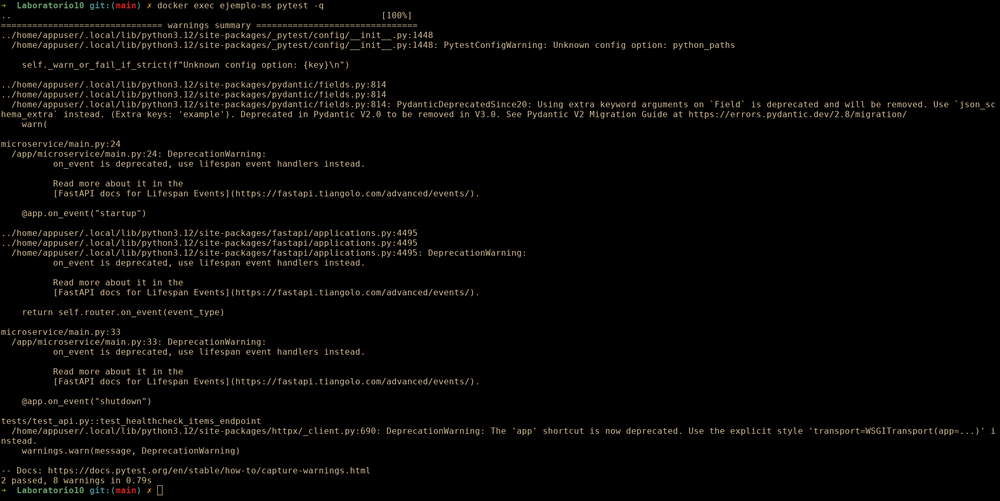
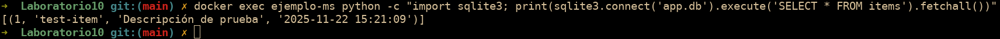

## Parte 1: Conceptualización de microservicios

### ¿Por qué microservicios?

- Explica la evolución: **Monolito -> SOA -> Microservicios**.

Rpta: Pasamos de tener todo en un bloque gigante (Monolito) a intentar dividirlo en servicios grandes y complejos (SOA). Finalmente llegamos a los Microservicios: piezas pequeñas y autónomas que hacen una sola cosa bien y se comunican fácil.

- Presenta **2 casos** (por ejemplo, e-commerce con picos estacionales, SaaS multi-tenant) donde el monolito se vuelve costoso de operar.

Rpta: 1) En un e-commerce durante Black Friday, el monolito te obliga a duplicar toda la app aunque solo necesites más potencia en el carrito. 2) En una app SaaS, si un cliente consume mucho, ralentiza a todos porque comparten los mismos recursos del monolito.

### Definiciones clave

- **Microservicio**: unidad de despliegue independiente, **una capacidad de negocio** por servicio, contrato definido por **API**.

Rpta: Es una unidad de software pequeña que maneja una capacidad de negocio completa y puede desplegarse sin afectar a los demás.

- **Aplicación de microservicios**: colección de servicios + **gateway**, **balanceo de carga**, **observabilidad** (métricas, logs, trazas).

Rpta: Es el sistema completo formado por todos los microservicios colaborando, más la infraestructura necesaria (Gateway, logs centralizados) para que funcionen como un todo coherente.

### Críticas al monolito

- Dos problemas típicos: **cadencia de despliegue** reducida y **acoplamiento** que impide escalar partes de forma independiente.

Rpta: El monolito es lento de desplegar porque cualquier cambio requiere recompilar todo y su alto acoplamiento hace que tocar una parte rompa otra fácilmente.

### Popularidad y beneficios

- Cita por qué empresas grandes los adoptaron (por ejemplo, **aislamiento de fallos**, **escalado granular**, **autonomía de equipos**).

Rpta: Empresas como Netflix los usan para que un fallo en un servicio no tumbe toda la plataforma (aislamiento), para escalar solo lo necesario y para que cada equipo trabaje a su ritmo con la tecnología que prefiera.

### Desventajas y retos

- Menciona 4 desafíos: **redes/seguridad**, **orquestación**, **consistencia de datos**, **testing distribuido**.

Rpta: Traen problemas complejos: la red puede fallar, coordinar cientos de servicios es difícil (orquestación), mantener los datos sincronizados es un dolor de cabeza y probar flujos entre varios servicios es mucho más difícil.

- Mitigaciones: **OpenAPI/contratos**, **pruebas contractuales**, **trazabilidad (Jaeger)**, **patrones de sagas**.

Rpta: Para sobrevivir, usamos contratos estrictos para las APIs, pruebas de contrato para no romper nada, trazabilidad para seguir errores entre servicios y Sagas para transacciones complejas.

### Principios de diseño

- **DDD**: límites contextuales para delimitar servicios.

Rpta: Usamos Domain-Driven Design para identificar los límites contextuales y saber exactamente qué debe ir en cada microservicio.

- **DRY** en microservicios: equilibrar librerías comunes vs **duplicación controlada** para reducir acoplamiento.

Rpta: A veces es mejor repetir código en dos servicios que obligarlos a compartir una librería que los ate. Preferimos duplicar un poco a estar atados.

- Criterios de tamaño: **una capacidad de negocio por servicio** es mejor que reglas rígidas (evita dogmas como "una tabla por servicio").

Rpta: El tamaño ideal no se mide en líneas de código, sino en funcionalidad: un servicio debe manejar una capacidad de negocio completa, no solo una tabla de base de datos.

## Empaquetado y verificación con Docker

### 1. Dockerfile

Captura del build del `Dockerfile`. Se puede apreciar el uso de **multi-stage builds** para reducir el tamaño de la imagen. Además se configura un usuario no-root (`appuser`) por seguridad y se definen las variables de entorno necesarias.
_Nota_: El Dockerfile proporcionado en el lab10 no necesitaba modificaciones.

### 2. Base de Datos en SQLite y Pytest

La primera imagen muestra la ejecución del contenedor y la inserción de datos mediante `curl` y los logs. Finalmente la segunda imagen muestra la ejecución del Pytest

Los datos se están guardando correctamente en la base de datos SQLite del contenedor.

### ¿Por qué no usar `latest`?

El tag `latest` es una etiqueta mutable que Docker asigna por defecto si no se especifica ninguna y su uso en producción es desaconsejado principalmente por la ambigüedad y falta de trazabilidad que introduce. real. Apunta a la última imagen etiquetada, lo que significa que puede sobrescribirse en cualquier momento y provocar que un despliegue hoy sea diferente a uno mañana con el mismo comando.

**Ventajas de SemVer:**
El uso de SemVer con etiquetas como `0.1.0` o `2.2.2` es preferible porque garantiza la reproducibilidad del entorno, asegurando que una etiqueta siempre apunte a esa versión específica del código. Si una nueva versión falla, podemos volver inmediatamente a la anterior con la certeza de que funcionará como antes.
