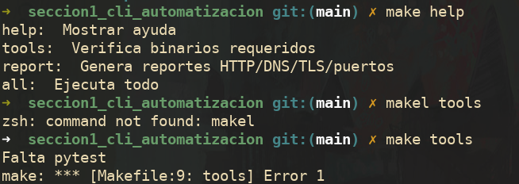
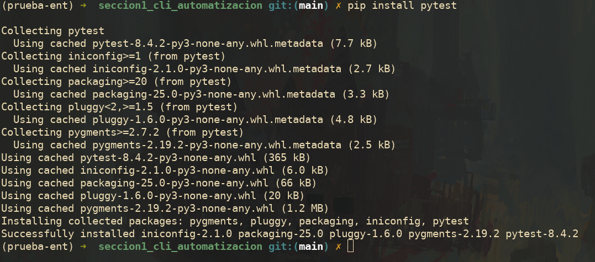
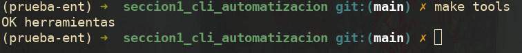
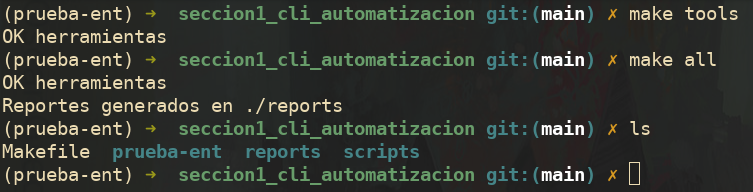

# Sección 1

Hago uso de **make help** para obtener todos los targets del archivo makefile. Compruebo con **make tools** que tenga las dependencias necesarias.

Para el caso de **pytest** voy a crear un entorno virtual e instalarlo ahí.  

Compruebo con **make tools** y corroboro que tengo todas las dependencias.

Finalmente ejecuto **make all** y genero el directorio **/reports** juntos a los archivos .txt

Los 4 archivos .txt fueron analizados y se completo las respuestas.

# Sección 2

# Sección 3
