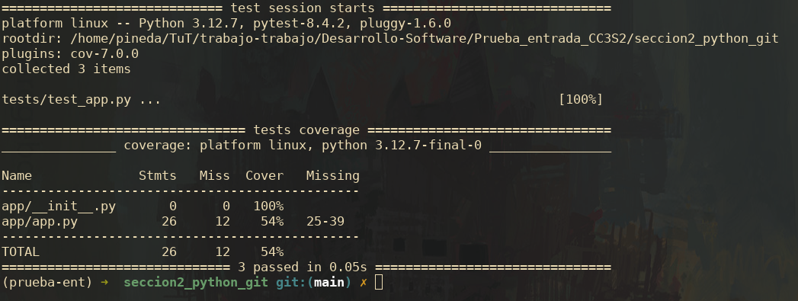
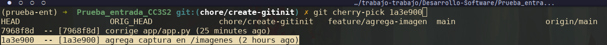
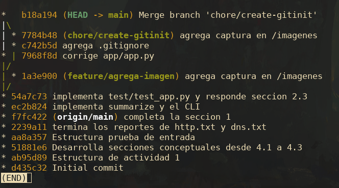
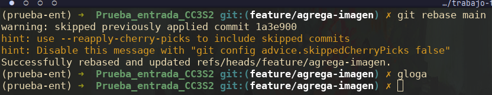
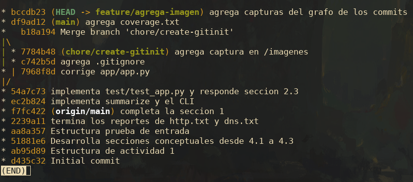

# Sección 1

Hago uso de **make help** para obtener todos los targets del archivo makefile. Compruebo con **make tools** que tenga las dependencias necesarias.

Para el caso de **pytest** voy a crear un entorno virtual e instalarlo ahí.

Compruebo con **make tools** y corroboro que tengo todas las dependencias.

Finalmente ejecuto **make all** y genero el directorio **/reports** juntos a los archivos .txt

Los 4 archivos .txt fueron analizados y se completo las respuestas.

# Sección 2
### Seccion 2.1 y 2.2

Se editaron los archivos **app.py** y **test.py**. Al hacer el coverage solo llegue a obtener un 54%

Se crearon las ramas **chore/create-gitinit** y **feature/agrega-image** para hacer ejemplos de **cherry-pick**, **FF** y **rebase**.

En la imagen de abajo podemos ver el caso de hacer cherry-pick el commit **1a3e900** en la rama **chore/create-gitinit** 

Caso de hacer FF de la rama **chore/create-gitinit** en la rama main

Caso de hacer el **rebase** de la rama **feature/agrega-imagen** en la rama main

### Seccion 2.3: Flujo Git

- **Merge Fast-Forward (FF):** Es el merge mas simple de todos, ocurre cuando fusionamos una rama que está directamente por delante de la rama destino. En lugar de crear un commit de merge, git simplemente mueve el puntero de la rama destino hacia adelante

- **Rebase:** Este comando reescribe la historia. Toma los commits de una rama y los vuelve a aplicar sobre el ultimo commit de otra rama. El resultado es también un historial lineal, como si todo el trabajo se hubiera hecho en serie

- **Cherry-pick:** Es una herramienta que nos permite copiar un único commit específico de una rama a otra. Es muy útil para aplicar un parche(hotfix) a una rama de producción sin tener que fusionar toda la rama de desarrollo que contiene otras funcionalidades que aun no se han completado

# Sección 3
